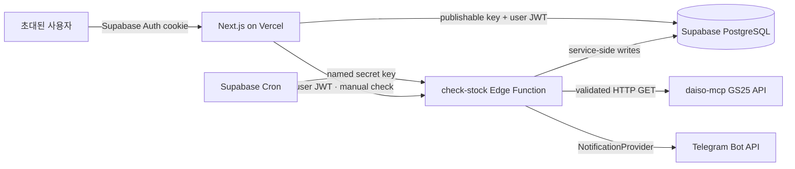

# Architecture

## Runtime topology

Vercel은 관리 UI와 인증된 검색 proxy를 담당한다. PC와 Vercel 요청이 없어도 Supabase Cron과 Edge Function이 재고 조회를 계속한다.

## Trust boundaries

- Browser에는 Supabase publishable key만 제공한다. 데이터 접근은 모든 public table의 RLS가 제한한다.
- `owner_id = auth.uid()`를 모든 사용자 소유 row에 적용해 초대 사용자 간 데이터를 분리한다.
- Supabase secret/service key, Cron automation key, `TELEGRAM_BOT_TOKEN`은 browser bundle에 포함하지 않는다.
- Cron은 Vault에 저장한 named secret key로 Edge Function을 호출한다.
- Edge Function의 사용자 호출은 현재 사용자 범위만, automation 호출은 due 상태인 사용자만 처리한다.
- 외부 API 결과는 runtime schema 검증 전에는 DB에 반영하지 않는다.

## Application boundaries

- Server Components: 인증된 초기 조회와 페이지 조합.
- Server Actions: 내부 CRUD mutation과 path revalidation.
- Route Handlers: GS25 상품/매장 검색처럼 외부 HTTP 경계가 필요한 GET 요청.
- Supabase Edge Functions: Cron, 수동 재고 검사, Telegram 전송처럼 Vercel 요청과 독립적으로 실행되어야 하는 작업.
- PostgreSQL: source of truth, row ownership, 최신 상태, 이벤트와 실행 이력.

## Monitoring target model

사용자는 Products와 Stores만 관리한다. 별도의 Watch List를 만들거나 상품과 매장을 직접 연결하지 않는다.

`check-stock`은 실행 시점에 `enabled = true`이고 `archived_at is null`인 상품과 매장을 각각 조회하고, 모든 활성 상품 × 모든 활성 매장을 자동 감시 대상으로 사용한다. 따라서 상품 또는 매장을 추가·재활성화하면 다음 조회부터 자동으로 전체 조합에 포함되고, 비활성화·archive하면 자동으로 제외된다.

## Inventory request model

`daiso-mcp`는 한 상품과 좌표를 기준으로 주변 여러 매장의 재고를 반환한다. 모든 활성 매장을 800m 범위로 clustering하고 상품 × cluster당 한 번 호출한 뒤 `storeCode`로 대상 매장의 결과를 추린다. 매장 누락이나 `realStockQuantity=null`은 품절로 간주하지 않는다.

공개 API의 GS25 계열 GET 제한은 IP당 KST 하루 3,000회다. 기본 안전 예산은 2,400회/일, 실행당 재고 요청 최대 12회다. 규모가 이 범위를 넘으면 조용히 일부만 검사하지 않고 configuration failure로 표시하며 `daiso-mcp` 자체 배포를 검토한다.

## Stock transitions

| Previous | Current | Event | Default notification |
| --- | --- | --- | --- |
| 없음 | 모든 정상 수량 | `initial` | 보내지 않음 |
| 0 | 양수 | `restocked` | 보냄 |
| 양수 | 0 | `sold_out` | 보내지 않음 |
| 서로 다른 양수 | 양수 | `changed` | 보내지 않음 |
| 동일 | 동일 | 없음 | 없음 |

Pickup/delivery 값만 바뀌면 최신 상태만 갱신하고 stock event는 만들지 않는다.

## Current platform notes

- Next.js 16에서는 인증 갱신 경계 파일이 `middleware.ts`가 아니라 `proxy.ts`다.
- Supabase의 2026-10-05 changelog에서 `@supabase/server`의 일부 framework adapter가 2026-12-01 제거 예정으로 표시됐다. Phase 9에서는 표준 fetch handler 또는 당시 권장 middleware bridge를 공식 문서로 다시 검증한다.
- public schema의 모든 table은 RLS를 활성화하며 `TO authenticated`만으로 허용하지 않고 소유권 조건을 함께 둔다.
- 내부 DB 함수는 기본적으로 `SECURITY INVOKER`를 사용하고 불필요한 `PUBLIC EXECUTE` 권한을 제거한다.
