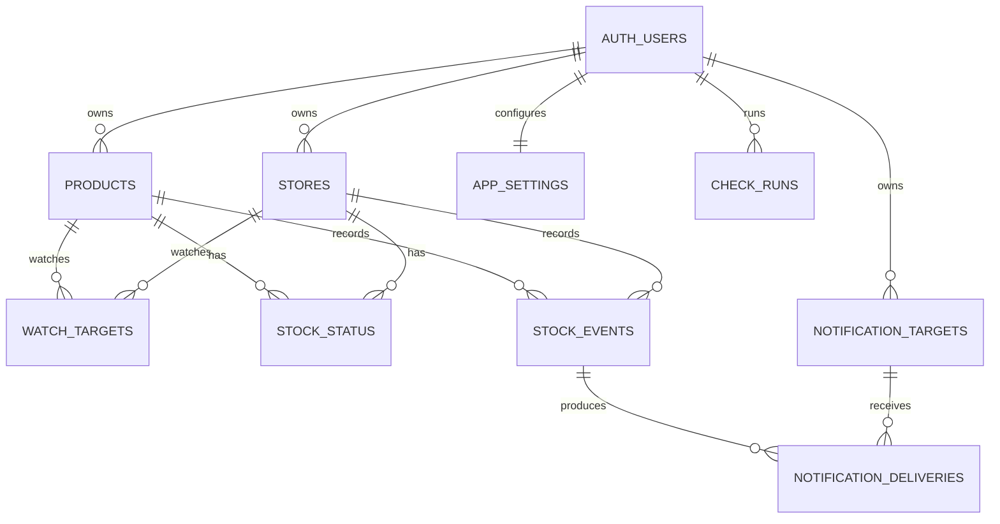

# Data model

## Ownership and deletion

All application rows are owned by a Supabase Auth user. RLS compares `owner_id` with `(select auth.uid())`, and ownership columns are indexed. Products, stores, watch targets, and notification targets use `archived_at` instead of browser-accessible hard deletion so stock and notification history remains referentially intact.

Products and stores have `(id, owner_id)` candidate keys. Dependent tables reference those composite keys, so a caller cannot construct a watch target, status, or event that combines rows from different owners even when IDs are known.

## Relations

## Write boundaries

- Authenticated browser clients may select, insert, and update their own products, stores, watch targets, notification targets, and settings.
- Browser clients have no table-level `DELETE` privilege. Archive actions are updates.
- Stock status, events, check runs, and delivery attempts are read-only to browser clients. Edge Functions write them with server-side credentials.
- The Telegram bot token is not represented in any table. Only destination identifiers such as `chat_id` are stored.

## Event integrity

The database validates the four supported stock transitions:

- `initial`: no previous quantity
- `restocked`: `0 -> positive`
- `sold_out`: `positive -> 0`
- `changed`: two different positive quantities

Per-target delivery rows make retries and partial Telegram failures observable without treating one `stock_events.notified` flag as a complete delivery log.
